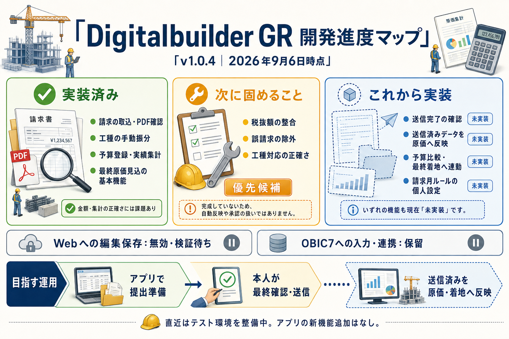

# Digitalbuilder GR 開発進度マップ

**公開版v1.0.4／2026年9月6日時点。** 実装済みの機能と、これから作る機能をまとめたイラストです。

[画像を原寸で開く](assets/progress-map-2026-09-06.png) · [詳しい進度・課題・実装条件](STATUS_AND_ISSUES.md)

## 進度をテキストで確認

| 状態 | 内容 |
| --- | --- |
| 実装済み | 請求取込、PDF確認、工種の手動振分、予算登録、保管済み履歴の実績集計、最終原価見込の基本機能 |
| 改善候補 | 税抜額の整合、誤請求の除外を実績にも反映、工種対応の正確さ |
| 修正済み・配布検証中 | 新規PC向けPDF依存DLLの同梱と導入時描画確認。SandboxでPDF描画・アプリの表示処理・再導入時の既存ファイル保護を確認 |
| 未実装 | 送信完了の確認と、送信済みデータを原価・予算比較・最終着地へ反映する一連の流れ |
| 実装予定 | 請求月の締め日・割当ルールを利用者が変更する個人設定 |
| 無効・検証待ち | Digital Billderへの編集保存 |
| 保留 | OBIC7への入力・連携、転記用画面、入力済み管理 |

予算比較・最終原価見込の基本機能は既にあります。イラストの「これから実装」は、**送信完了を起点とする連動**を指します。保管済み・送信済み・承認済みは同じ状態として扱いません。

## 目指す運用

**アプリで請求確認・振分・提出準備 → 本人がDigital Billderで最終確認・送信 → 確認できた送信済みデータをアプリの原価・着地へ反映。**

送信・承認をアプリが自動実行する構想ではありません。直近は検証環境の整備を進めており、アプリの新機能追加はありません。画像は上記日付のスナップショットです。優先順位全体と最新情報は [STATUS_AND_ISSUES.md](STATUS_AND_ISSUES.md) を参照してください。

イラストの制作・更新について

組込みimage_genで生成し、文字と実装状態を目視確認しました。実請求書・実台帳・資格情報を入力に使用していません。[生成プロンプト](assets/progress-map-2026-09-06.prompt.md)。

機能の状態が変わったら、先にSTATUS_AND_ISSUES.mdを更新し、画像は日付を付けた別ファイルとして作成して、このページとREADMEの参照先を更新します。

