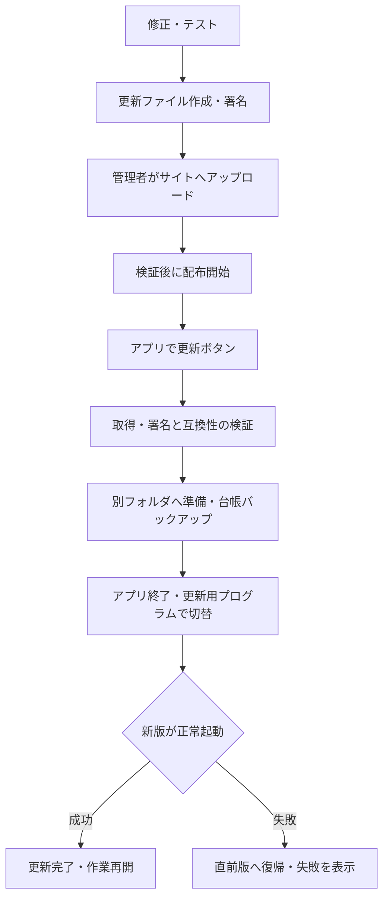

# 配布サイトとアプリ更新機構の評価

確認日: 2026-09-05（日本時間）
状態: **以下は実装前の評価・設計案です。同日、更新機構・アップロード画面を実装し、配布サイトとv1.0.1を公開しました。現在の仕様と操作は[アプリ更新の運用](UPDATE_GUIDE.md)を参照してください。**

## 結論

**実現可能です。今回の用途にも合っています。** Digital Billderの変更に合わせてこちらで修正・検証した版をサイトへ置き、利用者がアプリの「更新」を押すと取得・検証・再起動まで進む構成にできます。

必要なのは、①更新ファイルを作る仕組み、②アップロード・配信サイト、③PC側で安全に入れ替える仕組みの3つです。サイト作成より、現在の台帳を守りながら更新・復旧できるようにする部分の作業量が大きくなります。

この仕組みは「修正済みの版を利用者へ届ける」ためのものです。Digital Billderの変更内容を自動で理解し、修正コードを作る機能ではありません。通信データから読む新方式とも併用できます。

## 利用者と管理者の操作

| 利用者のPC | 更新を用意する側 |
| --- | --- |
| 管理画面の「更新を確認」を押す | Web変更に対応するコードを修正し、検証する |
| 現在版・最新版・変更内容を見る | 更新ファイルと、その版を証明する署名付き情報を作る |
| 「更新して再起動」を押す | サイトの管理画面へアップロードする |
| ダウンロードと検証が済んだら、作業を保存して終了する | 検証済みファイルと変更内容を確認し、配布を開始する |
| 再起動後に更新結果を確認する | 問題が見つかった版は新規配布を止め、修正版を出す |

ダウンロードはアプリ内で行い、配布サイトのページを利用者がブラウザーで開く必要をなくせます。ただし、この動作には下記の配信用アクセス設計が必要です。初回だけは、更新機構を含む版と起動入口を導入する作業が必要になります。

図の自動復帰は、台帳形式が互換で、更新後の新しい入力がまだない起動確認段階を基本とします。DB形式も変える更新の復旧は別途設計が必要です。

## Sitesで作れる部分と確認が必要な部分

Sitesのローカルスキル資料では、ファイル本体をR2、版番号・変更履歴・公開状態などをD1へ保存できます。管理者だけがアップロード・配布開始できる画面と、アプリが読む配信経路を設計するための機能はあります。実際のアカウントでの配信・容量・認証の動作は、今回まだ試していません。

| 構成 | 評価 |
| --- | --- |
| 更新履歴・最新版の案内ページ | 実装可能 |
| 管理者向けアップロード・配布開始画面 | 実装可能。サーバー側で管理者を確認し、一般利用者のアップロードを拒否する |
| 更新ZIPなどの保管 | R2を利用する構成が適合。サイト本体のソース・静的ファイルと更新パッケージを分ける |
| アプリ向け更新情報・ファイル配信 | 実装可能。アプリはページの見た目を解析せず、決まった形式の情報を読む |
| 非公開Sitesから無人で取得 | 未検証。非公開サイトはログインを要求するため、通常のHTTPダウンロードだけで通るとは限らない |
| 大きな実行環境込みの配布 | 実際の制限確認が必要。ストリーム配信や分割アップロードを検討する |

Sitesは公開サイトへの匿名閲覧と、ログインした利用者を確認する機能を持ちます。**更新ファイルを一般公開してよい場合は、配信部分を匿名で読めるようにし、管理画面は管理者限定にする構成が単純です。** 公開するのはアプリ配布物と変更履歴で、請求書・台帳・ログイン情報は含めません。ただし、Pythonソースを配布する場合はそのコードも第三者が取得可能になります。公開可否はまだ決めておらず、アクセス設定も変更していません。

非公開配布が必要な場合は、デスクトップアプリ用認証が成立するかを先に試験します。成立しない場合も、Sitesを管理画面として使い、認証付き配信を別の保管先へ分ける構成は候補です。調査用の認証回避トークンや管理者のログインCookieを全PCへ埋め込む設計は採りません。

Cloudflareには静的ファイルやアップロード要求のサイズ制限があり、R2の保管上限とHTTP入口の上限は別です。したがって、R2へ置けばあらゆる大きさの更新をそのままアップロードできるとは判断しません。Sites側に適用される枠も実装時に確認します。[Workersの制限](https://developers.cloudflare.com/workers/platform/limits/)、[R2の制限](https://developers.cloudflare.com/r2/platform/limits/)。

参照したSites資料: [保管機能](C:/Users/rinnt/.codex/plugins/cache/openai-bundled/sites/0.1.57/skills/sites-building/references/persistence-and-storage.md)、[認証](C:/Users/rinnt/.codex/plugins/cache/openai-bundled/sites/0.1.57/skills/sites-building/references/authentication.md)。

## 現在のアプリで先に整える箇所

| 現状 | 更新に必要な変更 |
| --- | --- |
| 起動.batが同じフォルダのPython環境とapp.pyを実行 | 安定した起動入口と、本体終了後に動く更新用プログラムを追加 |
| プログラム直下のdataに台帳・PDF・予算原本等を保存 | プログラムの版と無関係な固定データ領域を参照するようにする |
| アプリ全体の正式な版番号・更新履歴管理がない | アプリ版、配布通番、対応環境、DB形式、最低更新機構版を管理 |
| 起動時にDBの作成・変更処理が走る | DB形式の版管理、更新前互換性確認、順番を管理した移行処理を追加 |
| SQLiteのバックアップ処理は既存 | 更新前に必ず成功を確認し、復旧記録と結び付ける |
| requirementsは範囲指定。現在の仮想環境を利用 | 検証済み依存関係を固定し、旧版の環境を更新中に書き換えない |
| PyInstaller設定ファイルはある | 最近追加した機能・Playwright・ブラウザー等を含めた配布動作は再検証が必要 |
| 書込み用の構造変更ガードは基盤のみ | 更新で凍結状態を消さず、新しい対応構造を読み取り検証した上で復帰させる |

根拠: [起動.bat](../起動.bat)、[データ保存先・DB初期化](../invoice_manager/db.py)、[起動処理](../app.py)、[バックアップ](../invoice_manager/services/db_backup.py)、[依存関係](../requirements.txt)、[既存配布設定](../DigitalBuileder_GR.spec)、[Web書込みガード](../invoice_manager/services/web_allocation_guard.py)。

パス分離の初期段階では、既存dataを固定の参照先として指定し、ファイルの一斉移動を避ける案が取れます。将来専用フォルダへ移す場合は、DB内の添付・原本の参照先も検証します。パスが違うだけで新規の空台帳を作り、更新成功と扱うことを防ぐ必要があります。

ログインパスワードは既にWindowsの資格情報ストアへ分かれています。更新物に含めず、保存先の識別名を維持します。メール等の設定は台帳DBとともに保持します。[資格情報処理](../invoice_manager/services/digital_billder_credentials.py)。

## 安全な更新に必要な設計

以下は実装要件であり、現在すでに備わっている機能ではありません。

1. **正規の更新だと確認する。** アプリに信頼する公開鍵を持たせ、署名付き更新情報とファイルのハッシュ・サイズを検証する。HTTPSと同じサイトにあるハッシュだけでは、両方を書き換えられた場合の対策にならない。署名鍵は配布サイトや配布ファイルに入れず、更新を作る側で管理する。
2. **古い版や別製品を誤って入れない。** 製品ID、対象OS・CPU、アプリ版、配布通番、期限、対応環境を確認する。鍵の更新・失効も設計し、期限切れや検証失敗は現在版を維持する。旧い配布物の押付けを拒否することと、起動失敗時に保存済みの直前正常版へ戻ることは、別の処理として管理する。
3. **本体を上書きしながら更新しない。** 版ごとの別フォルダへ準備し、必要ファイルを検証する。全アプリインスタンスと取得・保存処理の終了を確認し、固定の起動入口が参照する版だけ切り替える。更新状態を記録し、電源断後にも処理を再開・復旧できるようにする。
4. **台帳を含むファイルを守る。** 配布物は許可されたプログラム・資材だけから作る。data、実請求PDF、設定、ログ、鍵、開発用.gitを含めない。展開時は保存先外へのパス、リンク、重複パス、Windowsの予約名、展開容量超過を拒否する。
5. **台帳のバックアップと互換性を確認する。** DB変更前に一貫したバックアップを取り、新形式での起動を確認する。更新後に利用者が入力した台帳を古いバックアップで自動的に置換しない。互換性のないDB変更に失敗した場合は、保守モードで状況を示して復旧する。
6. **更新を途中で止めても使える状態を保つ。** 通信切断、破損ZIP、容量不足、権限不足、ウイルス対策ソフトによるロックでは、切替前なら旧版を維持する。新版が起動確認に失敗したら直前正常版へ戻す。同じ失敗版を起動のたびに適用し続けない。
7. **配布の途中状態を見せない。** ファイルと署名情報がそろって検証できた後に、その版を「配布中」にする。同じ版のファイルを後から差し替えない。公開操作の履歴を残し、不具合版の配布停止と修正版公開を可能にする。

署名・ハッシュ・サイズ・版・有効期限を使う仕組みは、TUFの標準的な考え方に沿って設計し、実装時は既存ライブラリの採用を優先して評価します。ここでは独自の暗号プロトコルを確定していません。[TUFの概要](https://theupdateframework.io/docs/overview/)、[TUFのメタデータ](https://theupdateframework.io/docs/metadata/)。

SQLiteの一貫した複製にはBackup APIがあり、このアプリにもそれを使った既存処理があります。稼働中のapp.dbだけを単純コピーする方式へ置き換える必要はありません。[SQLite Backup API](https://www.sqlite.org/backup.html)。

## 最初の実装範囲の提案

**初版は、現在のPython・依存環境とDB形式を変えない、署名付きのプログラム一式更新に限定する案を推奨します。** Web読取りや構造検証の修正を届ける主要用途に対応しながら、環境更新・DB移行の難しい部分を分けて検証できます。対応環境が違う更新は明確に止め、手動の環境更新が必要だと表示します。

ここでいう一式はアプリコードと必要資材です。台帳や既存の仮想環境をZIPにまとめる意味ではありません。初版でも署名、バックアップ、終了待ち、別フォルダへの準備、起動確認、直前版への復帰は含めます。

仮想環境は一般に移動・コピー可能な配布物ではありません。後の段階で環境更新も自動化するなら、最終配置先に検証済み環境を新規構築してから有効化するか、検証済みの自己完結した配布形態を用意します。既存の共有環境へその場でpip更新する案は復帰が難しくなります。[Python venvの説明](https://docs.python.org/3/library/venv.html)。

| 段階 | 作るもの | 完了の目安 |
| --- | --- | --- |
| 1 | アプリ版・固定データ参照先・安定した起動入口 | 今の台帳・添付・設定のまま起動でき、開発中のチェックアウトは更新対象にしない |
| 2 | 署名付き更新ファイル作成・ローカル更新機構 | 架空データで正常更新、破損拒否、起動失敗からの復帰を確認 |
| 3 | Sitesの管理画面・ファイル保管・配信用経路 | 管理者だけが配布操作でき、予定するPCから署名付きファイルを取得できる |
| 4 | アプリの更新ボタンとサイトを接続 | 更新内容確認から再起動まで完了し、台帳・設定・凍結状態が保持される |
| 5 | 環境更新・DB形式変更への対応拡大 | 版ごとの互換性と復旧手順を個別に検証 |

DB移行時の復旧を含むため、中規模以上の機能追加です。単なるダウンロードボタンとして見積もるのは適切ではありません。コード配布版と実行環境込み配布版、公開配布と非公開配布の選択によって作業量が変わるため、現時点では所要日数を確定しません。

## Digital Billder変更への対応との関係

想定運用は「構造変更を検知して該当機能を停止 → こちらで対応版を修正・試験 → 配布 → 利用者が更新 → 新構造を確認して利用再開」です。更新しただけで永続凍結を無条件に解除する設計にはしません。書込みは引き続き「編集を保存」までで、「次に回す」は対象外です。

更新確認と更新ファイルの取得は配布サイトに対して行うため、Digital Billderの請求を再取得する必要はありません。通常の請求取得速度は維持し、動作確認でも不要な全件走査や連続リトライを避けます。現在の通信データ方式への切替えと、この更新機構は別々に進められます。

## 実装着手前に決める事項と今回の範囲

- **配布対象と公開範囲:** このPCだけか、他の利用者にも配るか。配布物を一般公開できるか。一般公開不可ならPC向け認証の試験を先に行う。
- **初版の範囲:** 上記の環境・DB形式を維持するプログラム更新から始めるか、最初から実行環境込みの配布を必要とするか。
- **更新を出す運用:** 誰が修正・検証・署名を行い、誰がサイトで配布開始するか。初期案は修正側で署名済みファイルを作り、管理者がアップロード・配布開始する。

今回の評価では回答を求めて作業を止める必要はありません。上記の未決定事項を明示した上で構成と実装順を整理しています。

Sitesの公開手順には専用サイトソースのコミット・プッシュが含まれます。利用者指定の「勝手なコミット・プッシュをしない」を維持し、実際に公開する段階ではその操作を対象とした指示が必要です。今回、サイト作成・アップロード・デプロイ・コミット・プッシュは行っていません。[Sites公開手順](C:/Users/rinnt/.codex/plugins/cache/openai-bundled/sites/0.1.57/skills/sites-hosting/SKILL.md) の該当記述は “Commit the exact validated source.” および “Push it with the returned credential” です。

今回行ったのはローカルのコード・配布設定・Sites資料と、更新検証・DBバックアップに関する公式資料の確認です。Digital Billderへはアクセスせず、台帳・資格情報・アプリコードを変更していません。
